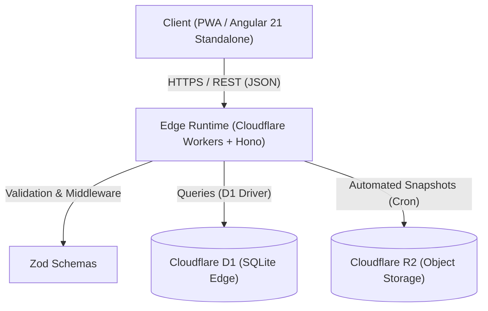

# 📚 Tsuzuki (続き)

[](https://angular.dev/)
[](https://www.typescriptlang.org/)
[](https://workers.cloudflare.com/)
[](https://hono.dev/)
[](https://vitest.dev/)
[](LICENSE)

> Personal, self-hosted, offline-first media tracker PWA designed to log and monitor reading/watching progress across Manga, Anime, Manhwa, Light Novels, and Donghua with zero hosting cost and automated multi-tier disaster recovery.

---

## 🎯 Overview

**Tsuzuki** (*"continuación / lo que sigue"*) addresses the bloat, vendor lock-in, and downtime of commercial platforms (MyAnimeList, AniList) by providing a private, mobile-first tracker where the primary action (`+1 chapter / episode`) takes exactly one tap.

Built on an Edge-native serverless architecture, it delivers sub-50ms latency globally, operates strictly within free-tier quotas, and adheres to extreme durability standards for relational user data.

---

## 🏗️ Architecture & System Design



### Architecture Highlights
- **Reactivity & State**: Angular 21 Standalone Components with modern Signals (`signal`, `computed`, `effect`), Zoneless-ready change detection (`OnPush`), and native template control flow (`@if`, `@for`).
- **Edge Backend**: Hono v4 compiled to V8 Isolates with zero cold starts and strict payload validation via Zod.
- **Relational Storage**: Cloudflare D1 (distributed SQLite) with strict foreign keys, CHECK constraints, and ULID primary keys.
- **Resilience Strategy**: 3-2-1 backup rotation (hourly D1 snapshots, automated export to Cloudflare R2 bucket, manual encrypted local export).

---

## 🛠️ Tech Stack

| Layer | Technologies & Tooling |
| :--- | :--- |
| **Frontend** | Angular 21, TypeScript 5.9 (Strict), RxJS, NgIcons (@ng-icons/heroicons), PWA (Service Worker) |
| **Backend & Edge** | Cloudflare Workers, Hono v4, Cloudflare D1 (SQLite), Cloudflare R2 Storage |
| **Testing & Quality** | Vitest, JSDOM, axe-core (WCAG AA & Accessibility compliance) |
| **Tooling & DX** | pnpm v10, Wrangler CLI v4, Angular CLI v21, Prettier |

---

## 🚀 Getting Started

### Prerequisites
- **Node.js**: `v22.x` (LTS recommended)
- **Package Manager**: `pnpm` (v10.x+)
- **Cloudflare Account** *(for deploying workers and D1 database)*

### 1. Clone & Install

```bash
git clone https://github.com/your-username/tsuzuki.git
cd tsuzuki
pnpm install
```

### 2. Environment Configuration

Copy the sample environment file and adjust your variables:

```bash
cp .env.example .env
```

### 3. Local Development

Run the frontend client and the Cloudflare edge worker concurrently:

```bash
# Start the Angular frontend (http://localhost:4200)
pnpm run start

# Start the Cloudflare Worker API locally via Miniflare
pnpm run worker
```

---

## 📜 Available Scripts

| Command | Description |
| :--- | :--- |
| `pnpm run start` | Serves the Angular application locally (`ng serve`). |
| `pnpm run worker` | Runs local edge API worker using `wrangler dev`. |
| `pnpm run build` | Compiles production assets into `dist/index/browser`. |
| `pnpm run test` | Executes unit test suites using `vitest`. |
| `pnpm run watch` | Builds application continuously in development mode. |

---

## 📂 Project Structure

```text
tsuzuki/
├── docs/                 # Architecture Decision Records (ADRs) & Specifications
│   ├── conceptos/        # Deep-dive tech explainers (Angular, Workers, D1)
│   └── media-tracker/    # Functional specs, development plan & deployment guides
├── migrations/           # D1 SQLite database migration files
├── src/                  # Angular 21 PWA source code
│   └── app/
│       ├── components/   # Presentational & container UI components
│       ├── services/     # Angular injectables & data access
│       └── models/       # TypeScript strict interfaces & domain models
├── workers/              # Serverless Edge backend
│   └── api/              # Hono REST API handlers & Zod validation schemas
├── wrangler.jsonc        # Cloudflare Workers & D1 configuration
└── package.json          # Dependencies & project scripts
```

---

## 🤝 Contributing

Contributions, issues, and feature requests are welcome!

1. **Fork the Project**
2. **Create your Feature Branch**:
   ```bash
   git checkout -b feat/amazing-feature
   ```
3. **Commit your Changes**:
   Follow [Conventional Commits](https://www.conventionalcommits.org/):
   ```bash
   git commit -m "feat(tracker): add fast-increment swipe gesture"
   ```
4. **Push to the Branch**:
   ```bash
   git push origin feat/amazing-feature
   ```
5. **Open a Pull Request**

> [!NOTE]
> All code must adhere to Angular strict mode, pass all `vitest` specs, and comply with WCAG AA accessibility standards (`axe-core`).

---

## 📄 License

This project is licensed under the [MIT License](LICENSE).
