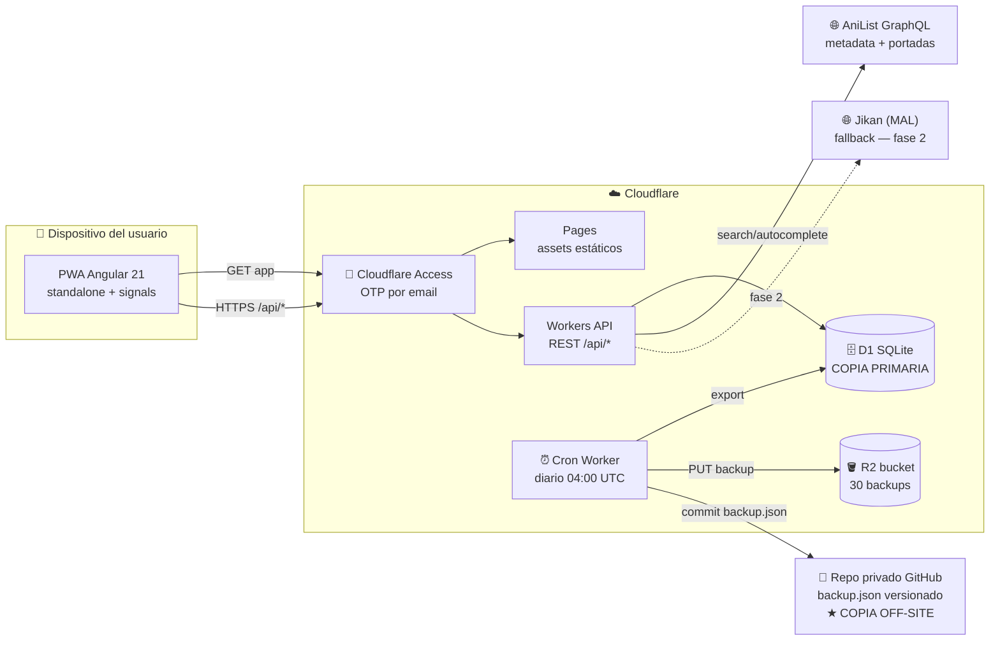
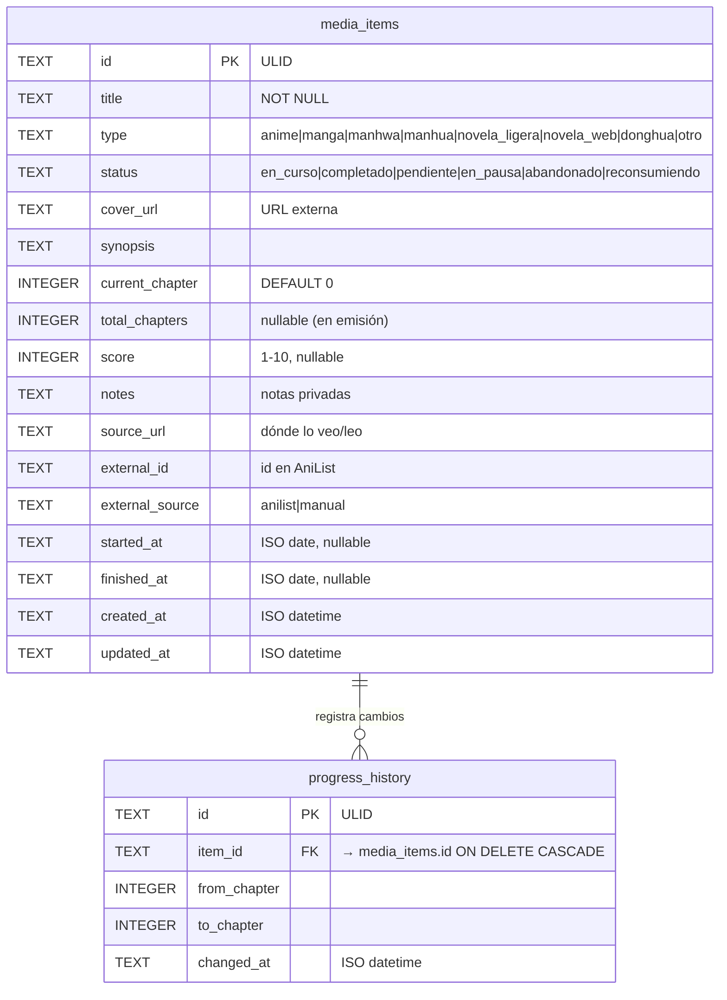
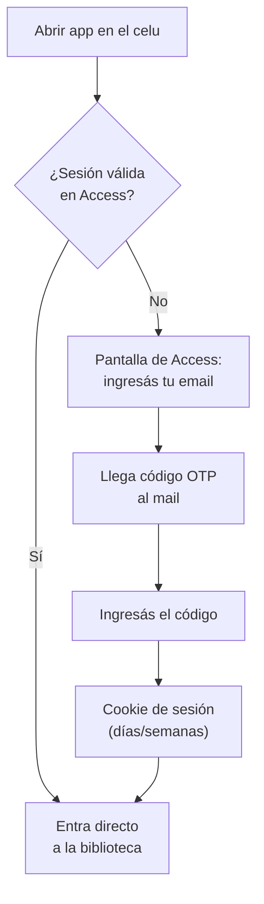
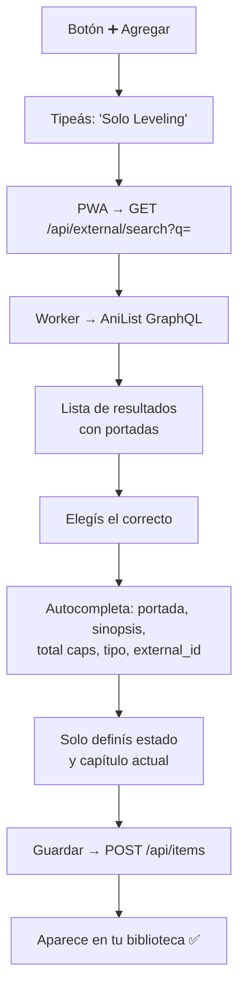
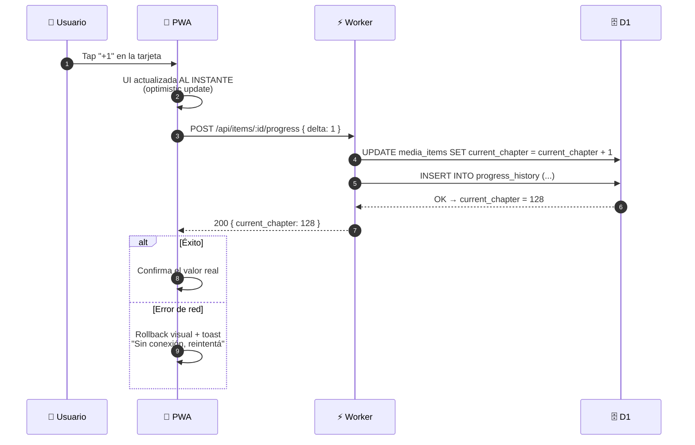
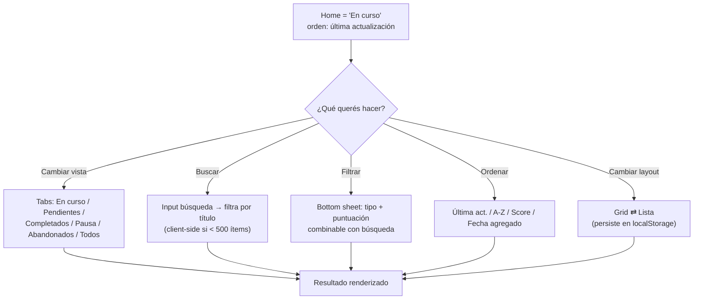
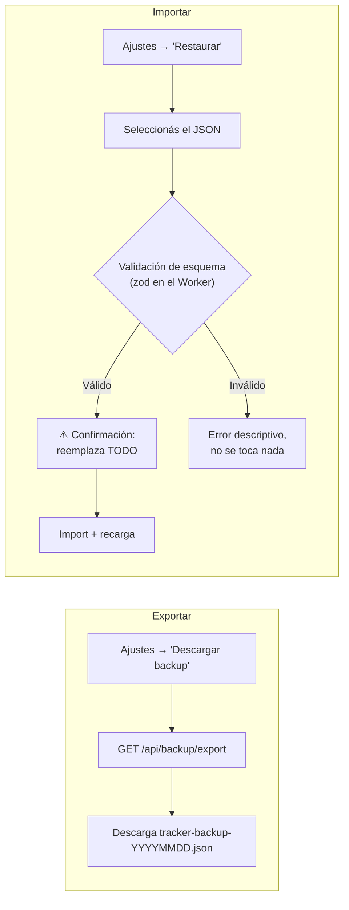
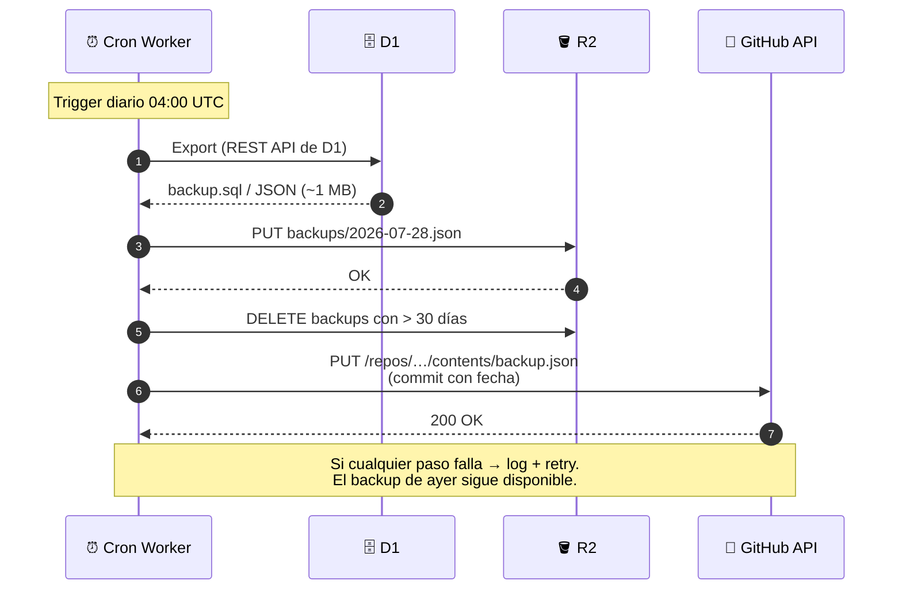
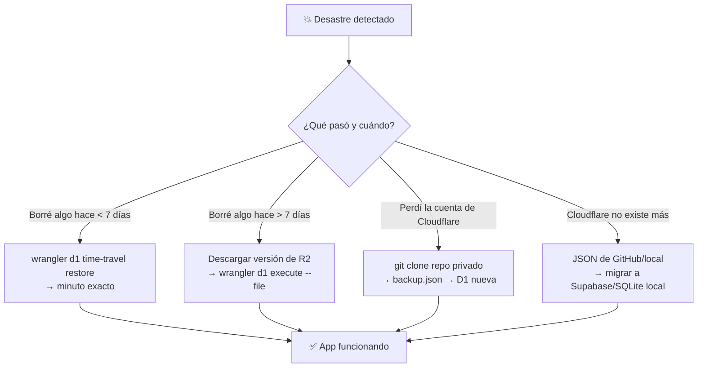

# 📚 Tsuzuki (続き) — Requerimientos y Arquitectura

> **Estado**: v1.1 — Decisiones cerradas, listo para SDD
> **Fecha**: 2026-07-28
> **App**: `Tsuzuki` — "continuación", "lo que sigue"
> **Repo**: `index` (Angular 21 + TypeScript 5.9 strict)
> **Dominio**: `pages.dev` (gratuito, sin dominio propio)

---

## Tabla de contenidos

1. [Visión](#1-visión)
2. [Alcance y roadmap](#2-alcance-y-roadmap)
3. [Decisiones de arquitectura](#3-decisiones-de-arquitectura)
4. [Requerimientos Funcionales (RF)](#4-requerimientos-funcionales-rf)
5. [Requerimientos No Funcionales (RNF)](#5-requerimientos-no-funcionales-rnf)
6. [Arquitectura general](#6-arquitectura-general)
7. [Modelo de datos](#7-modelo-de-datos)
8. [Flujos de usuario](#8-flujos-de-usuario)
9. [Flujos del sistema (backups y recuperación)](#9-flujos-del-sistema-backups-y-recuperación)
10. [API REST (borrador)](#10-api-rest-borrador)
11. [Matriz de recuperación ante desastres](#11-matriz-de-recuperación-ante-desastres)
12. [Estrategia de testing](#12-estrategia-de-testing)
13. [Decisiones pendientes](#13-decisiones-pendientes)

---

## 1. Visión

Un **AniList / MyAnimeList personal y self-hosted**: una PWA mobile-first para trackear el progreso de animes, mangas, manhwas, manhuas, novelas ligeras/web y donghuas — en qué capítulo/episodio quedé, qué tengo pendiente, qué completé, qué abandoné — con datos autocompletados desde APIs públicas y una estrategia de backups que garantiza **no perder la información bajo ningún motivo**.

**Principios rectores:**

- 🏗️ **Fundamentos primero**: nada se construye sin spec aprobada (flujo SDD).
- 📉 **Data diminuta → durabilidad extrema**: la DB completa será < 5 MB; respaldarla en múltiples destinos cuesta $0.
- 📱 **Mobile-first real**: la acción principal (`+1 capítulo`) debe ser de UN toque.
- 💸 **Costo $0**: todo dentro de free tiers.
- 🚫 **Sin sobre-ingeniería**: es single-user; la escalabilidad NO es prioridad.

---

## 2. Alcance y roadmap

### Fase 1 — MVP

| Área | Incluye |
|---|---|
| Auth | Cloudflare Access (OTP por email, cero código de login) |
| Biblioteca | CRUD completo, estados, +1 rápido, filtros, grid/lista |
| Datos externos | Autocompletado desde AniList (GraphQL) |
| PWA | Instalable, splash, ícono, cache básica |
| Backups | Cron diario → R2 (30 versiones) + push a repo privado GitHub |
| Datos | Export/Import JSON desde la app |

### Fase 2 — Post-MVP

| Área | Incluye |
|---|---|
| Stats | Gráficos de progreso, historial visual |
| Importación | Importar lista existente desde MyAnimeList/AniList |
| Resiliencia | Jikan como fallback de AniList, modo offline completo |
| Extras | Tags personalizados, temporada actual de animes en emisión |

---

## 3. Decisiones de arquitectura

| # | Decisión | Opción elegida | Alternativas descartadas | Razonamiento |
|---|---|---|---|---|
| AD-01 | Plataforma | **Cloudflare full-stack** (Pages + Workers + D1) | Supabase, Firebase | Un solo proveedor, $0, auth gratis con Access |
| AD-02 | Base de datos | **Cloudflare D1** (SQLite) | Firestore (NoSQL), Supabase Postgres | Los filtros combinables (estado+tipo+score) piden SQL; SQLite sobra para single-user |
| AD-03 | Autenticación | **Cloudflare Access** (OTP email) | Auth propia, Supabase Auth | Gratis hasta 50 usuarios, cero código de login, protege app + API |
| AD-04 | Portadas | **URLs externas** (AniList/CDN) | Subir imágenes a R2 | Ahorra storage y ancho de banda; las portadas no son data crítica |
| AD-05 | Fuente de metadata | **AniList GraphQL** (primario) | Jikan (fallback fase 2) | Una sola API cubre anime + manga + novelas + manhwa (por país de origen) |
| AD-06 | Backups | **D1 → R2 + GitHub off-site** | Solo Time Travel | Time Travel free = solo 7 días (ver RNF-11) |
| AD-07 | Frontend | **Angular 21 standalone + signals** | — | Dictado por convenciones del repo (`AGENTS.md`) |
| AD-08 | Hosting frontend | **Cloudflare Pages** (assets estáticos) | SSR con express | La app es una SPA/PWA; SSR no aporta valor acá. El express del scaffold se descarta |

---

## 4. Requerimientos Funcionales (RF)

### 4.1 Gestión de biblioteca

| ID | Requerimiento | Prioridad |
|---|---|---|
| RF-01 | CRUD completo de ítems. Tipos: `anime`, `manga`, `manhwa`, `manhua`, `novela_ligera`, `novela_web`, `donghua`, `otro` (extensible) | MUST |
| RF-02 | Campos por ítem: título, tipo, portada (URL), sinopsis, estado, capítulo/episodio actual, total de capítulos (opcional), puntuación personal (1–10), notas privadas, link de dónde lo veo/leo, fecha inicio, fecha fin | MUST |
| RF-03 | Estados: `en_curso`, `completado`, `pendiente`, `en_pausa`, `abandonado`, `reconsumiendo` | MUST |
| RF-04 | **Incremento rápido de progreso** (+1 / +N) desde la tarjeta, sin entrar al detalle, con actualización optimista de UI | MUST |
| RF-05 | Pantalla principal = "En curso"; vista "Pendientes" (backlog) | MUST |
| RF-06 | Búsqueda por título + filtros combinables (estado, tipo, puntuación) | MUST |
| RF-07 | Ordenamiento: última actualización, alfabético, puntuación, fecha de agregado | MUST |
| RF-08 | Vista grid de portadas ⇄ vista lista compacta (preferencia persistida) | MUST |
| RF-09 | Detalle de ítem con edición inline de todos los campos | MUST |
| RF-10 | Historial de progreso por ítem (cuándo avancé y cuánto) | SHOULD |

### 4.2 Integración con APIs externas

| ID | Requerimiento | Prioridad |
|---|---|---|
| RF-11 | Buscador "Agregar nuevo" que consulte **AniList GraphQL** y autocomplete portada, sinopsis, total de capítulos/episodios y tipo | MUST |
| RF-12 | Portadas guardadas como URL externa (no se almacenan imágenes propias salvo excepción manual) | MUST |
| RF-13 | *(Fase 2)* Fallback a Jikan (MyAnimeList) si AniList no tiene el ítem | COULD |

### 4.3 Autenticación y acceso

| ID | Requerimiento | Prioridad |
|---|---|---|
| RF-14 | Acceso protegido por Cloudflare Access (OTP al email del owner) | MUST |
| RF-15 | Sesión persistente (cookie de Access, duración días/semanas) | MUST |
| RF-16 | Toda ruta de la app **y** de la API inaccesible sin sesión válida | MUST |
| RF-17 | El Worker valida el JWT `CF_Authorization` como defensa en profundidad | SHOULD |

### 4.4 Datos: exportación, backups y restauración

| ID | Requerimiento | Prioridad |
|---|---|---|
| RF-18 | Exportar backup completo en JSON desde la app (descarga directa) | MUST |
| RF-19 | Importar/restaurar desde JSON (con validación de esquema) | MUST |
| RF-20 | Backup automático diario vía Cron Worker: export de D1 → R2, retención de 30 versiones | MUST |
| RF-21 | Réplica off-site automática: el mismo backup se pushea a un repo **privado** de GitHub (versionado git) | MUST |
| RF-22 | *(Fase 2)* Importar lista desde cuenta de MyAnimeList/AniList | COULD |

---

## 5. Requerimientos No Funcionales (RNF)

| ID | Categoría | Requerimiento |
|---|---|---|
| RNF-01 | Plataforma | Deploy 100% Cloudflare (Pages + Workers + D1 + R2). Costo: **$0** en free tiers |
| RNF-02 | PWA | Instalable (manifest + íconos + splash), sin barra de browser, service worker con cache de assets y última lectura de biblioteca |
| RNF-03 | UX | Mobile-first. Densidad de información pensada para pantalla de teléfono |
| RNF-04 | Seguridad | HTTPS obligatorio (Cloudflare lo provee). Ningún dato accesible sin auth, incluyendo la API |
| RNF-05 | Performance | Carga inicial < 2 s en 4G. `+1 capítulo` con update optimista (perceptible: instantáneo) |
| RNF-06 | Resiliencia red | Con mala/sin conexión: al menos visualizar la biblioteca cacheada |
| RNF-07 | Accesibilidad | WCAG AA: contraste, focus visible, ARIA, navegación por teclado (exigido por `AGENTS.md`) |
| RNF-08 | Escalabilidad | **No prioridad** (single-user). Índices correctos y listo — prohibido sobre-ingenierizar |
| RNF-09 | Código | TypeScript strict, sin `any`, standalone components, signals, OnPush (ver `AGENTS.md`) |
| RNF-10 | Límites free tier | D1: 5 GB / 5M lecturas día / 100k escrituras día. R2: 10 GB. Workers: 100k requests/día. Consumo estimado real: **< 1%** de cada límite |
| RNF-11 | Durabilidad | **RPO ≤ 24 h** (máx. 1 día de cambios perdidos en el peor escenario) y **RTO ≤ 1 h**. Time Travel cubre < 7 días; R2/GitHub cubren el resto |

> ⚠️ **Gotcha verificado (docs oficiales, 2026)**: Time Travel de D1 en plan **free = 7 días** de ventana (los 30 días son del plan pago). Por eso los backups automáticos son MUST y no nice-to-have.

---

## 6. Arquitectura general

**Regla de oro de la arquitectura**: ninguna capa confía en la anterior para la durabilidad. D1 puede morir, R2 puede morir, la cuenta puede perderse — y aun así el repo de GitHub (+ una descarga manual ocasional) reconstruye todo en minutos.

---

## 7. Modelo de datos

### 7.1 Diagrama ER

### 7.2 Índices

| Índice | Columnas | Justificación |
|---|---|---|
| `idx_items_status` | `status` | Filtro principal de las vistas |
| `idx_items_type` | `type` | Filtro secundario |
| `idx_items_updated` | `updated_at DESC` | Orden default "última actualización" |
| `idx_items_title` | `title COLLATE NOCASE` | Búsqueda case-insensitive |
| `idx_history_item` | `item_id, changed_at` | Historial por ítem |

### 7.3 Reglas de integridad

- `current_chapter >= 0`; si `total_chapters` no es null → `current_chapter <= total_chapters`.
- Al pasar a `completado` → setear `finished_at` (y `current_chapter = total_chapters` si existe).
- Al pasar a `en_curso` por primera vez → setear `started_at`.
- Todo cambio de `current_chapter` inserta una fila en `progress_history` (RF-10).
- IDs: ULID en texto (ordenables, generables en el Worker sin dependencias).

---

## 8. Flujos de usuario

### 8.1 Login (Cloudflare Access)

### 8.2 Agregar ítem con autocompletado (RF-11)

### 8.3 El flujo estrella: `+1 capítulo` (RF-04, RNF-05)

### 8.4 Explorar la biblioteca (RF-05/06/07/08)

### 8.5 Exportar / importar JSON (RF-18/19)

---

## 9. Flujos del sistema (backups y recuperación)

### 9.1 Backup automático diario (RF-20/21)

### 9.2 Flujo de restauración según escenario

---

## 10. API REST (borrador)

Base: `/api/*` — todo detrás de Cloudflare Access. JSON in/out. Errores: `{ error: string, code: string }`.

| Método | Endpoint | Descripción | RF |
|---|---|---|---|
| GET | `/items?status=&type=&q=&sort=&order=` | Lista con filtros combinados | RF-05/06/07 |
| GET | `/items/:id` | Detalle + historial | RF-09/10 |
| POST | `/items` | Crear ítem | RF-01 |
| PATCH | `/items/:id` | Editar campos | RF-09 |
| POST | `/items/:id/progress` | Body: `{ delta }` o `{ value }` — el +1 rápido | RF-04 |
| DELETE | `/items/:id` | Eliminar (con confirmación en UI) | RF-01 |
| GET | `/external/search?q=` | Proxy a AniList (evita CORS y esconde lógica) | RF-11 |
| GET | `/backup/export` | Descarga JSON completo | RF-18 |
| POST | `/backup/import` | Restaura desde JSON validado | RF-19 |

**Notas de diseño:**

- `POST /items/:id/progress` es **transaccional**: update del ítem + insert en `progress_history` en un batch de D1.
- El Worker es la única puerta a D1 (nada de queries desde el cliente).
- Validación de payloads con `zod` en el Worker (mismo esquema reutilizable en el front).

---

## 11. Matriz de recuperación ante desastres

| # | Escenario | Herramienta de recuperación | Pérdida máxima | Tiempo de recuperación |
|---|---|---|---|---|
| DR-1 | Borrado accidental reciente (< 7 días) | D1 Time Travel | Minutos | < 15 min |
| DR-2 | Borrado antiguo (> 7 días) | Backup en R2 (30 versiones) | ≤ 24 h | < 30 min |
| DR-3 | Migración/schema roto | Time Travel o R2 | ≤ 24 h | < 30 min |
| DR-4 | Pérdida de la cuenta de Cloudflare | Repo GitHub (off-site) | ≤ 24 h | < 1 h |
| DR-5 | Cloudflare deja de existir | GitHub + descarga local → otro proveedor | ≤ 24 h | Horas (migración) |
| DR-6 | Ransomware/corrupción lógica | Historial git del repo + R2 | ≤ 24 h | < 1 h |

**Cobertura "bajo ningún motivo"**: para perder los datos habría que perder simultáneamente D1 + R2 + GitHub + cualquier descarga local. Probabilidad: despreciable.

---

## 12. Estrategia de testing

| Capa | Herramienta | Qué se testea |
|---|---|---|
| Frontend | **Vitest** (ya en el repo) | Componentes con signals, filtros/orden (lógica pura), flujo optimistic del +1 |
| Worker | **Vitest + `@cloudflare/vitest-pool-workers`** | Endpoints, validación zod, transacción de progress |
| Accesibilidad | **axe** en tests de componente | WCAG AA (RNF-07) |
| E2E (fase 2) | Playwright | Login simulado, +1, agregar ítem |

Modo **Strict TDD** recomendado vía flujo SDD: spec → test que falla → implementación → verde.

---

## 13. Decisiones pendientes

| # | Pregunta | Decisión final | Estado |
|---|---|---|---|
| P-1 | ¿AniList en MVP o fase 2? | **MVP** — sin autocompletado la app no es viable para uso diario | ✅ |
| P-2 | ¿Dominio propio o `*.pages.dev`? | **`pages.dev`** — gratis, para uso personal sobra | ✅ |
| P-3 | ¿Repo GitHub nuevo y privado para backups? | **Sí** — `tsuzuki-backups`, privado | ✅ |
| P-4 | ¿Nombre de la app? | **Tsuzuki** (続き) — "continuación, lo que sigue" | ✅ |
| P-5 | ¿Idioma de UI? | **Español** — métricas/tipos en inglés (los devuelve la API así) | ✅ |

---

> **Próximo paso**: `/sdd-init` → proposal → specs → tasks → implementación con TDD.
